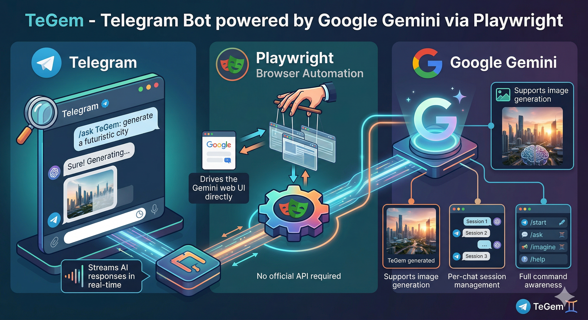

# TeGem

<p align="center">
  
</p>

<p align="center">
  <strong>Telegram bot powered by Google Gemini via Playwright browser automation.</strong><br/>
  Real-time streaming · Per-chat Gemini sessions · Vision, image, music, and video workflows
</p>

<p align="center">
  
  
  
  
  
</p>

## Overview

TeGem bridges Telegram and the Gemini web UI by driving `gemini.google.com` directly through Playwright. There is no Gemini API integration: the bot uses a persistent logged-in Chrome profile and automates the Gemini interface.

The project is built around isolated Gemini conversations per Telegram session key:

- private chat: one Gemini conversation per Telegram user
- group chat: one Gemini conversation per Telegram user per group
- persistent restore across restarts through `.playwright/profiles/.../sessions.json`

## Features

| Feature | Details |
|---|---|
| Real-time streaming | Reads Gemini's DOM while the model is generating and edits the Telegram placeholder message progressively |
| Per-session isolation | One Playwright page per session key, with per-session locking to avoid interleaved prompts |
| Vision / OCR workflows | `/q` works with attached media and replied-to media; `/vision` describes a replied image or attached file |
| Image generation | `/imagine` captures generated images and forwards them to Telegram |
| Music generation | `/music` downloads Gemini's generated video and MP3 outputs, then sends text separately |
| Video generation | `/video` downloads generated video and sends any text as a normal Telegram message |
| Reply threading in groups | If a user tags the bot while replying to someone else, the bot answers under the original replied-to message |
| Access control | Optional `ALLOWED_USERS` / `ALLOWED_GROUPS` allowlist gating |
| Persistent login | Chrome profile is stored under `.playwright/` and reused on restart |

## Architecture

```text
Telegram User
     │
     ▼
 grammY Bot
     │
     ├── commands (/q, /vision, /imagine, /music, /video, /voice, ...)
     ├── group mention / reply routing
     └── auth middleware
           │
           ▼
 GeminiSessionManager
   ├── one BrowserContext (shared profile)
   ├── one Page per sessionKey
   ├── per-session mutex
   └── ConversationStore (sessions.json)
           │
           ▼
 GeminiProvider
   ├── sendPrompt()
   ├── streamResponse()
   ├── uploadFile()
   ├── captureImages()
   ├── downloadGeneratedMusic()
   ├── downloadGeneratedMedia()
   └── downloadLastResponseAudio()
           │
           ▼
 gemini.google.com/app
```

## Project Structure

```text
TeGem/
├── src/
│   ├── bot/
│   │   ├── bot.ts
│   │   ├── sessionKey.ts
│   │   ├── commands/
│   │   │   ├── clear.ts
│   │   │   ├── help.ts
│   │   │   ├── imagine.ts
│   │   │   ├── music.ts
│   │   │   ├── start.ts
│   │   │   ├── status.ts
│   │   │   ├── video.ts
│   │   │   └── voice.ts
│   │   └── middleware/
│   │       ├── auth.ts
│   │       └── typing.ts
│   ├── gemini/
│   │   ├── conversationStore.ts
│   │   ├── errors.ts
│   │   ├── provider.ts
│   │   ├── session.ts
│   │   └── types.ts
│   ├── config.ts
│   └── index.ts
├── docs/
├── .env.example
├── package.json
└── tsconfig.json
```

## Requirements

- Node.js >= 20
- Google Chrome or Chromium
- a Google account that can access Gemini
- a Telegram bot token from `@BotFather`

## Setup

```bash
git clone git@github.com:0xfunboy/TeGem.git
cd TeGem
npm install
```

Optional Playwright browser install:

```bash
npm run playwright:install
```

Create `.env`:

```bash
cp .env.example .env
```

Minimum required:

```env
TELEGRAM_BOT_TOKEN=123456789:AAF...
```

Optional access control:

```env
ALLOWED_USERS=123456789,987654321
ALLOWED_GROUPS=-1001234567890,-1009876543210
```

Run in development:

```bash
npm run dev
```

Run in production:

```bash
npm run build
npm start
```

On startup the bot warms the browser context, opens Gemini, and verifies that the logged-in session is usable. The persistent profile is stored under `.playwright/profiles/...`.

## Bot Commands

| Command | Description |
|---|---|
| `/start` | Welcome message |
| `/help` | Show command list |
| `/clear` | Reset the current session's Gemini conversation |
| `/status` | Show session key, stored conversation, tab count, and runtime state |
| `/q <question>` | Ask a question; also works with attached media or by replying to someone else's image |
| `/vision [prompt]` | Describe or analyze a replied-to image/document, or an attached one |
| `/imagine <description>` | Generate an image |
| `/music <description>` | Generate music and send the downloaded media plus text separately |
| `/video <description>` | Generate a video and send text separately if present |
| `/voice` | Try to capture Gemini's TTS audio for the last response |

Group behavior:

- plain text in groups is ignored unless the bot is mentioned
- mention replies inherit the replied-to text as context
- `/q` and `/vision` can work on media without a bot mention

## Configuration Reference

| Variable | Default | Description |
|---|---|---|
| `TELEGRAM_BOT_TOKEN` | — | Required Telegram bot token |
| `ALLOWED_USERS` | empty | Comma-separated Telegram user IDs allowed in private chat |
| `ALLOWED_GROUPS` | empty | Comma-separated Telegram group chat IDs where the bot is active |
| `PLAYWRIGHT_HEADLESS` | `false` | Run Chrome headless |
| `PLAYWRIGHT_EXECUTABLE_PATH` | auto | Override Chrome executable path |
| `PLAYWRIGHT_BROWSER_CHANNEL` | `chrome` | Browser channel if no executable path is given |
| `PLAYWRIGHT_BASE_PROFILE_DIR` | `.playwright/profiles` | Base profile directory |
| `GEMINI_PROFILE_DIR` | `_shared` | Shared Chrome profile directory name |
| `STREAM_POLL_INTERVAL_MS` | `700` | DOM polling interval during streaming |
| `STREAM_STABLE_TICKS` | `4` | Number of unchanged polls before settling a response |
| `STREAM_FIRST_CHUNK_TIMEOUT_MS` | `25000` | Initial response timeout |
| `STREAM_MAX_DURATION_MS` | `90000` | Max response duration |
| `SYSTEM_PROMPT` | built-in text | Currently loaded in config but not injected in runtime flow |

## Deployment Notes

- one Chrome profile is shared by every session
- one Playwright page is kept open per active session key
- sessions are persisted in `.playwright/profiles/<namespace>/sessions.json`
- on low-memory hosts, long uptime with many users will increase tab usage

For headless servers, Xvfb is still the safest option:

```bash
sudo apt-get install -y xvfb fonts-liberation libgbm1
Xvfb :99 -screen 0 1440x960x24 &
DISPLAY=:99 PLAYWRIGHT_HEADLESS=false npm start
```

## Documentation

| Doc | Description |
|---|---|
| [Architecture](docs/architecture.md) | Runtime layers, session model, DOM automation strategy |
| [Commands](docs/commands.md) | Command semantics and media/reply behavior |
| [Setup Guide](docs/setup.md) | Installation, login, deployment, and operations |
| [Troubleshooting](docs/troubleshooting.md) | Common failures and practical fixes |
| [Handoff](docs/HANDOFF.md) | Current operational handoff for future work |

## License

Existing MIT permissions are preserved. See [LICENSING.md](LICENSING.md) for the terms applying to eligible original material.
